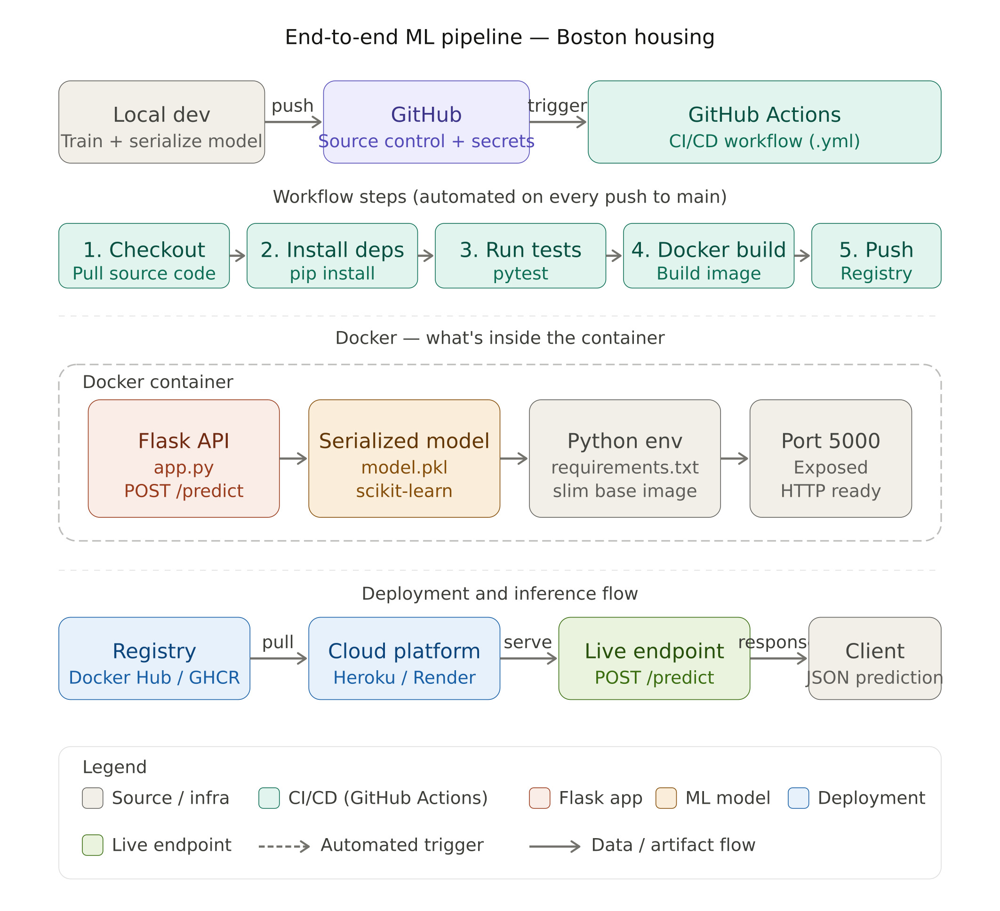

# End-to-End ML Pipeline — Boston Housing Regression

> **Note:** This project is not primarily about machine learning. It's a hands-on demonstration of a production-grade ML pipeline — covering containerization, CI/CD automation, and cloud deployment using a simple regression model as the payload.

---

## What This Project Is About

This repository walks through the full lifecycle of shipping a machine learning model to production. The Boston Housing dataset and a linear regression model serve as a convenient, well-understood vehicle — the real learning is in everything surrounding the model: how you package it, test it, automate it, and deploy it.

If you're looking for advanced ML techniques, this isn't it. If you're looking to understand how a model goes from a Jupyter notebook to a live API endpoint with automated CI/CD, you're in the right place.

---

## Pipeline Overview

```
Code Push → GitHub Actions → Docker Build → Container Registry → Deployment
```

Each stage is intentional and independently meaningful:

**1. Model Training & Serialization**
A scikit-learn regression model is trained on the Boston Housing dataset and serialized to disk (`.pkl`). This is the artifact the rest of the pipeline ships.

**2. Flask API**
The serialized model is wrapped in a lightweight Flask web server that exposes a `/predict` endpoint. Input features come in as JSON, predictions go out as JSON.

**3. Dockerization**
The Flask app and model are packaged into a Docker image. This eliminates "works on my machine" problems and makes the deployment unit completely portable.

**4. GitHub Actions (CI/CD)**
Every push to the main branch triggers an automated workflow that:
- Installs dependencies
- Runs tests
- Builds the Docker image
- Pushes the image to a container registry
- Deploys to the target environment

**5. Deployment**
The Docker container is deployed to a cloud platform (e.g. Heroku, Render, or similar), making the prediction endpoint publicly accessible.

---

## Project Structure

```
├── app.py                  # Flask application and prediction endpoint
├── model/
│   ├── train.py            # Model training script
│   └── model.pkl           # Serialized trained model
├── templates/
│   └── index.html          # Simple front-end form (optional)
├── Dockerfile              # Container definition
├── requirements.txt        # Python dependencies
├── .github/
│   └── workflows/
│       └── deploy.yml      # GitHub Actions CI/CD pipeline
└── README.md
```

---

## Getting Started

### Prerequisites

- Python 3.8+
- Docker Desktop
- A GitHub account (for CI/CD)
- A deployment platform account (Heroku, Render, etc.)

### Run Locally (without Docker)

```bash
# Clone the repository
git clone https://github.com/OmarEmadAldin/End-To-End-ML-Regression-Buston-Housing.git
cd End-To-End-ML-Regression-Buston-Housing

# Install dependencies
pip install -r requirements.txt

# Train the model
python model/train.py

# Start the API
python app.py
```

The API will be available at `http://localhost:5000`.

### Run with Docker

```bash
# Build the image
docker build -t boston-housing-api .

# Run the container
docker run -p 5000:5000 boston-housing-api
```

### Make a Prediction

Send a POST request to the `/predict` endpoint with the feature values:

```bash
curl -X POST http://localhost:5000/predict \
  -H "Content-Type: application/json" \
  -d '{"features": [0.006, 18.0, 2.31, 0, 0.538, 6.575, 65.2, 4.09, 1, 296.0, 15.3, 396.9, 4.98]}'
```

---

## The CI/CD Pipeline (`.github/workflows/deploy.yml`)

The GitHub Actions workflow is the heart of this project. Here's what happens on every push to `main`:

```yaml
# Simplified view of the workflow stages
on: push (main branch)

jobs:
  build-and-deploy:
    1. Checkout code
    2. Set up Python
    3. Install dependencies
    4. Run tests
    5. Log in to container registry
    6. Build Docker image
    7. Push image to registry
    8. Deploy to cloud platform
```

Secrets like registry credentials and deployment API keys are stored as GitHub repository secrets and injected at runtime — never hardcoded.

---

## Docker Breakdown

The `Dockerfile` follows a standard pattern for Python ML APIs:

```dockerfile
FROM python:3.9-slim          # Lean base image
WORKDIR /app
COPY requirements.txt .
RUN pip install -r requirements.txt   # Dependencies cached as a layer
COPY . .
EXPOSE 5000
CMD ["python", "app.py"]
```

Key decisions:
- `python:slim` keeps the image small by stripping unnecessary system packages
- Copying `requirements.txt` before the rest of the code means the dependency layer is cached unless requirements change — significantly speeding up repeated builds

---

## Dataset

The Boston Housing dataset contains 506 samples with 13 features describing properties of housing in Boston suburbs. The target variable is the median home value (`MEDV`) in thousands of dollars.

| Feature | Description |
|---------|-------------|
| CRIM | Per-capita crime rate |
| RM | Average number of rooms |
| LSTAT | % of lower-status population |
| PTRATIO | Pupil-teacher ratio |
| ... | (13 features total) |

---

## Key Concepts Demonstrated

| Concept | Tool/Technology |
|---------|-----------------|
| Model serialization | `joblib` / `pickle` |
| REST API for inference | Flask |
| Containerization | Docker |
| CI/CD automation | GitHub Actions |
| Secrets management | GitHub Secrets |
| Cloud deployment | Heroku / Render |

---
## The sequence



